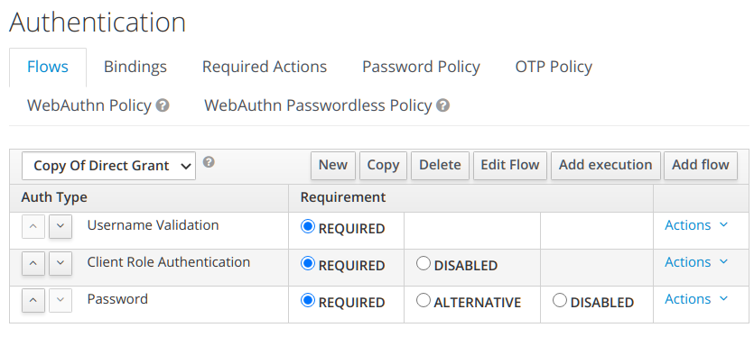
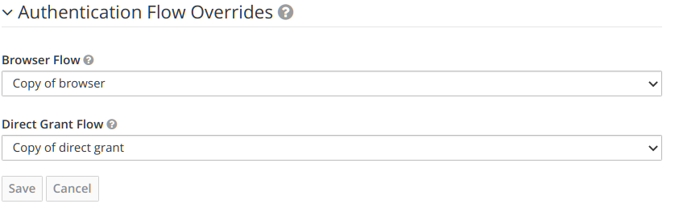
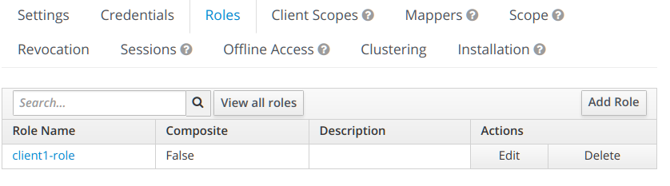
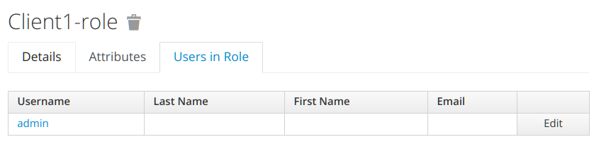

# Client Role Authenticator

Using default keycloak installation, there is no default authenticator
that can authenticate user based on the client role. This feature should
be included by default!

When a user is authenticated using a client, the client role
should be assigned to the user, so the authentication is successful.

If there is no client role then this will fail.
The user need at least 1 client role to be assigned.

## Build

Use maven to build
```shell
mvn compile package
```

## Installation using Keycloak docker

Copy the jar to /opt/jboss/keycloak/standalone/deployments

```shell
docker run \
  -v $PWD/target/rbac.jar:/opt/jboss/keycloak/standalone/deployments/rbac.jar \
  jboss/keycloak:12.0.1
```

This will automatically deployed to keycloak. 

## Configuration

The following is a sample configuration. We're using "Direct Grant"
for the authentication flow. Start by "Copy" the "Direct Grant"
to a new flow.

Add "Client Role Authentication" to the execution flow:



Above, the "Client Role Authentication" is placed before Password.

In the __Clients__ page, override the flow:



Create a client role:



Assign the role to user:



## References

- [Keycloak](https://keycloak.org)
- [Keycloak Docker](https://hub.docker.com/r/jboss/keycloak)